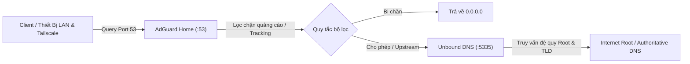

# Sổ Tay Vận Hành & Triển Khai Homelab DNS (Runbook)

Tài liệu hướng dẫn triển khai, vận hành, nâng cấp và khắc phục sự cố hệ thống DNS nội bộ Homelab với kiến trúc Single Node: **AdGuard Home** kết hợp **Unbound Recursive DNS**.

---

## 1. Kiến Trúc Hệ Thống (Architecture)

Toàn bộ dịch vụ DNS được vận hành trên **1 node duy nhất** sử dụng Docker Compose với chế độ mạng `network_mode: host` để đạt hiệu năng tối đa và giữ nguyên địa chỉ IP gốc của từng client.



### Chi tiết cổng và dịch vụ
| Dịch vụ | Container | Cổng lắng nghe | Chức năng |
| :--- | :--- | :--- | :--- |
| **Unbound** | `unbound` | `127.0.0.1:5335` (TCP/UDP) | Máy chủ đệ quy nội bộ (Root Hints, DNSSEC, cache tối ưu 128MB, thuần IPv4). |
| **AdGuard Home DNS** | `adguardhome` | `0.0.0.0:53` (TCP/UDP) | Tiếp nhận truy vấn từ các thiết bị, lọc chặn quảng cáo, chuyển tiếp sang Unbound. |
| **AdGuard Home Web UI**| `adguardhome` | `0.0.0.0:8080` (HTTP) | Bảng điều khiển quản trị, thống kê truy vấn, cấu hình client và bộ lọc. |

---

## 2. Chuẩn Bị Môi Trường (Prerequisites)

### 2.1 Cài đặt Docker & Docker Compose
Đảm bảo máy chủ đã cài đặt Docker Engine và Docker Compose plugin:
```bash
docker --version
docker compose version
```

### 2.2 Giải phóng cổng 53 (Nghiêm ngặt)
Trên các bản phân phối Linux như Fedora, Ubuntu, Debian, dịch vụ `systemd-resolved` thường chiếm cổng `53`. Để AdGuard Home có thể bind cổng 53:

1. Chỉnh sửa cấu hình `systemd-resolved`:
   ```bash
   sudo mkdir -p /etc/systemd/resolved.conf.d/
   cat << 'EOF' | sudo tee /etc/systemd/resolved.conf.d/adguard.conf
   [Resolve]
   DNS=127.0.0.1
   DNSStubListener=no
   EOF
   ```
2. Cập nhật symlink file resolv.conf và restart dịch vụ:
   ```bash
   sudo ln -sf /run/systemd/resolve/resolv.conf /etc/resolv.conf
   sudo systemctl restart systemd-resolved
   ```
3. Kiểm tra cổng 53 đã trống:
   ```bash
   sudo ss -tulpn | grep :53
   ```
   *(Nếu không còn tiến trình nào chiếm cổng 53 là hoàn tất).*

---

## 3. Cấu Trúc Thư Mục Repository

```text
homelab/
├── compose.yaml                         # File compose duy nhất định nghĩa Unbound và AdGuard Home
├── .gitignore                           # Bảo vệ tuyệt đối file cấu hình runtime và dữ liệu cá nhân
├── RUNBOOK.md                           # Sổ tay vận hành và hướng dẫn này
├── adguard/
│   ├── confdir/
│   │   ├── AdGuardHome.example.yaml     # File mẫu cấu hình chuẩn hóa (upstream Unbound, 8 blocklists)
│   │   └── AdGuardHome.yaml             # File cấu hình thực tế trên máy (được .gitignore bảo vệ)
│   └── workdir/                         # Thư mục lưu database, query logs, cache bộ lọc
└── unbound/
    └── unbound.conf                     # Cấu hình đệ quy Unbound tối ưu
```

---

## 4. Hướng Dẫn Triển Khai Lần Đầu (Initial Setup)

### Bước 1: Sao chép repository về máy chủ
```bash
git clone <REPO_URL> ~/homelab
cd ~/homelab
```

### Bước 2: Chuẩn bị file cấu hình AdGuard Home
Tạo các thư mục runtime và sao chép cấu hình mẫu:
```bash
mkdir -p adguard/confdir adguard/workdir
cp adguard/confdir/AdGuardHome.example.yaml adguard/confdir/AdGuardHome.yaml
```

*(Tùy chọn)* Nếu bạn đã có hash mật khẩu quản trị hoặc muốn đổi mật khẩu, mở file `adguard/confdir/AdGuardHome.yaml` và chỉnh sửa trường `password:` của user `admin`.

### Bước 3: Khởi chạy cụm dịch vụ
Khởi động cả Unbound và AdGuard Home bằng 1 lệnh duy nhất:
```bash
docker compose up -d
```

---

## 5. Kiểm Thử & Xác Minh Hoạt Động (Verification)

Sau khi khởi chạy, thực hiện các lệnh sau để đảm bảo hệ thống vận hành đúng:

### 5.1 Kiểm tra trạng thái containers
```bash
docker compose ps
```
Cả `unbound` và `adguardhome` phải ở trạng thái `Up` / `running`.

### 5.2 Kiểm tra Unbound đệ quy nội bộ (Port 5335)
```bash
dig @127.0.0.1 -p 5335 cloudflare.com +short
```
*Kỳ vọng:* Trả về địa chỉ IP của Cloudflare (ví dụ: `104.16.132.229`).

### 5.3 Kiểm tra AdGuard Home lọc chặn quảng cáo (Port 53)
```bash
dig @127.0.0.1 doubleclick.net +short
```
*Kỳ vọng:* Trả về `0.0.0.0` (chặn thành công).

### 5.4 Truy cập giao diện quản trị Web UI
Mở trình duyệt trên máy cùng mạng LAN hoặc qua Tailscale:
- Địa chỉ: `http://<IP_MÁY_CHỦ>:8080`
- Tài khoản: `admin` / mật khẩu bạn đã thiết lập.

---

## 6. Hướng Dẫn Vận Hành Thường Nhật & Cập Nhật (Day-2 Operations)

### 6.1 Cập nhật phiên bản mới (Update / Upgrade)
Khi muốn kéo mã nguồn mới nhất hoặc cập nhật image Docker của AdGuard Home và Unbound:
```bash
cd ~/homelab
git pull origin main
docker compose pull
docker compose up -d
```
Docker sẽ tự động cập nhật image mới và tái tạo container mà **không làm mất dữ liệu hay cấu hình** (do dữ liệu nằm trong `adguard/confdir` và `adguard/workdir`).

### 6.2 Xem logs thời gian thực
- Xem log toàn bộ hệ thống:
  ```bash
  docker compose logs -f
  ```
- Xem riêng log AdGuard Home:
  ```bash
  docker compose logs -f adguardhome
  ```
- Xem riêng log Unbound:
  ```bash
  docker compose logs -f unbound
  ```

### 6.3 Khởi động lại dịch vụ khi thay đổi cấu hình
- Khi sửa `adguard/confdir/AdGuardHome.yaml`:
  ```bash
  docker compose restart adguardhome
  ```
- Khi sửa `unbound/unbound.conf`:
  ```bash
  docker compose restart unbound
  ```

### 6.4 Dừng / Khởi động lại toàn bộ
- Dừng toàn bộ hệ thống:
  ```bash
  docker compose down
  ```
- Khởi động lại:
  ```bash
  docker compose up -d
  ```

---

## 7. Sao Lưu & Khôi Phục (Backup & Disaster Recovery)

### 7.1 Sao lưu (Backup)
Toàn bộ quy tắc chặn, danh sách client bypass, DNS rewrites và mật khẩu nằm duy nhất trong file `adguard/confdir/AdGuardHome.yaml`. Để tạo bản sao lưu:
```bash
tar -czvf adguard-backup-$(date +%Y%m%d).tar.gz adguard/confdir/AdGuardHome.yaml
```

### 7.2 Khôi phục sang máy mới (Restore)
1. Trên máy mới, chuẩn bị môi trường Docker và clone repo `homelab`.
2. Đặt file `AdGuardHome.yaml` đã sao lưu vào thư mục `adguard/confdir/`.
3. Chạy `docker compose up -d`. Toàn bộ thiết lập cũ sẽ được phục hồi 100%.

---

## 8. Hướng Dẫn Dọn Dẹp Cụm Đa Node Cũ (Cluster Cleanup)

Nếu bạn đã từng chạy cấu hình đồng bộ (AdGuardHome-Sync) hoặc chạy thử nghiệm trên máy phụ (Secondary Node - HP), hãy thực hiện dọn dẹp như sau:

### 8.1 Trên máy chính (iMac)
Gỡ bỏ container `adguardhome-sync` không còn sử dụng:
```bash
docker stop adguardhome-sync 2>/dev/null || true
docker rm adguardhome-sync 2>/dev/null || true
```

### 8.2 Trên máy phụ (HP)
Nếu máy HP không còn dùng làm máy chủ DNS:
```bash
docker stop adguardhome unbound 2>/dev/null || true
docker rm adguardhome unbound 2>/dev/null || true
```
Nếu muốn giải phóng hoàn toàn thư mục cũ trên máy HP:
```bash
rm -rf ~/homelab
```
